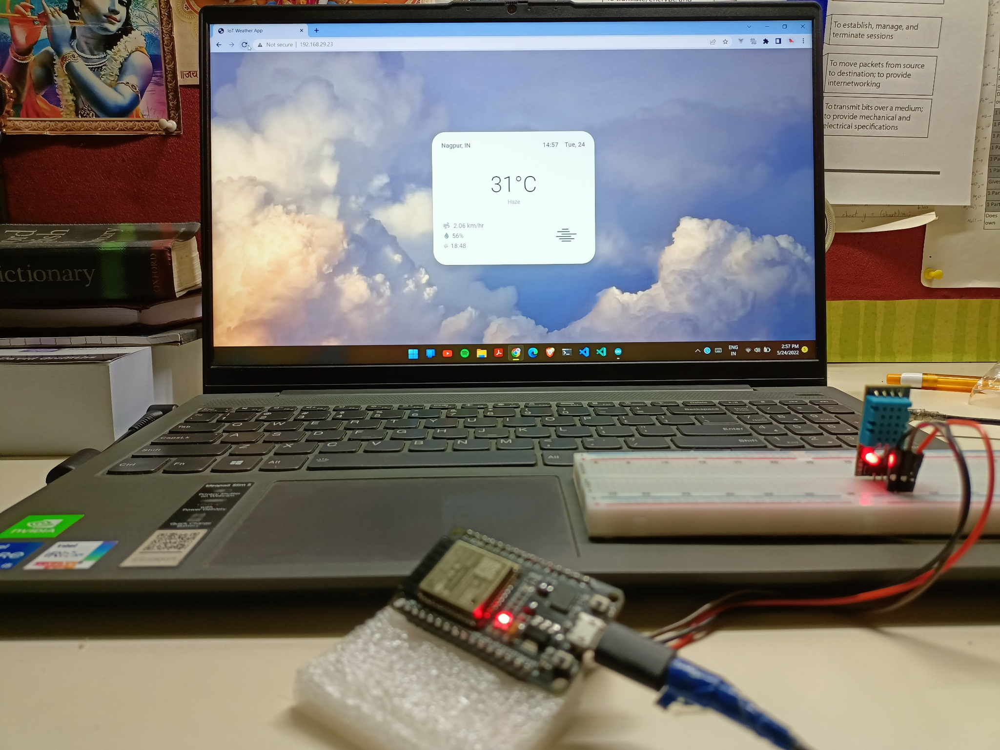
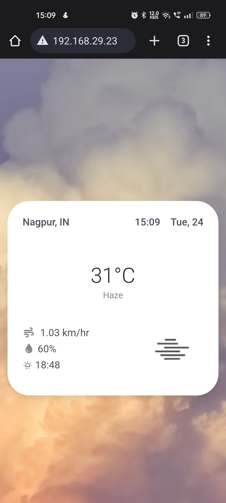

# IoT Weather App

Get temperature and humidity data from an ESP32 sensor and display it onto your web browser wirelessly.

## Components

- Breadboard (medium)
- DHT11 Sensor
- ESP32
- WiFi Router / Hotspot
- Wires

---

## API Dependancies

API Key used in this project belongs [@RndmCodeGuy20](https://github.com/RndmCodeGuy20/). While using this app, please change the default API key with your key.

---

## Demo



<center>Hardware Setup</center>
<br>



<center>Cross Platform</center>

---

## Development

To run this program on your local setup, follow these steps :

1. Connect data pin of DHT11 to pin 15 of the ESP32, VCC of DHT11 to 3.3V pin and GND of DHT11 to GND of ESP32.
2. Change this piece of code in the `WebServerTH.ino` file.

   ```C++
    const char *ssid = "************";        // Enter SSID here
    const char *password = "***************"; // Enter Password here
   ```

   <center> to </center>

   ```C++
    const char *ssid = "Your-WiFi-Name";        // Enter SSID here
    const char *password = "Your-WiFi-Password"; // Enter Password here
   ```

3. Connect ESP32 to your computer and run this program through the Arduino IDE.
4. Open your IDE's serial monitor, and copy the IP address and paste it in your browser.

> 💀 in case of any issue or error, feel free to raise an issue alongwith a screenshot of the error and serial monitor.

---

## Note for OSS Contributors :

☠️ meta folder contains an HTML file, if you wish to change the UI/UX of the application, first try to change it in that HTML file.

☠️ Once you have debugged the file, paste its contents <strong style="color:red">CAREFULLY</strong> into the arduino file.

☠️ Before raising an issue, try to analyze the `sendHTML()` function, there is a high chance your problem might be related to this function.

## Contributing

All contributions are welcome!
